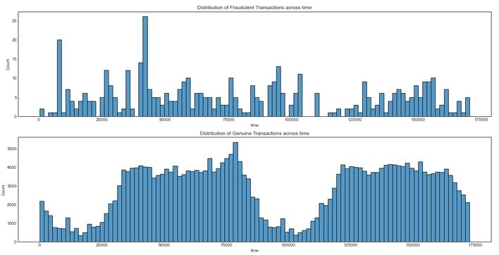
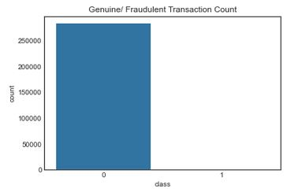
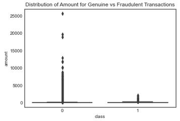
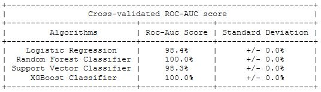
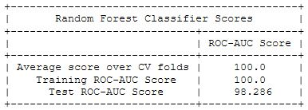

# Detecting Fraudulent Transactions

---

### Objective

The project objective is to help a bank detect fraudulent credit card transactions. Fraudulent transactions could be a major issue for banks due to first and foremost the loss of money from credit card replacement, administrative costs and refund, amongst others. Further, having known to have fraudulent transactions occur undetected would hurt the bank's reputation. 

Having a model that can detect fraudulent transactions could prevent future losses. This is a binary classification data science problem where I build a model to identify fraudulent transactions. The dataset comprise credit card transactions in September 2013, by european cardholders. Some considerations while working on this data is dealing with imbalanced classes and the evaluation metric, to prioritise recall or precision. These will be addressed in detail in my analysis and findings. 

### Framework

* 01. [Data cleaning and EDA](code/01-data-cleaning-and-eda.ipynb)
* 02. [Preprocessing Data and Modelling](code/02-preprocessing-and-modelling.ipynb)

### Folder Organisation 

    |__ code
    |   |__ 01-data-cleaning-and-eda.ipynb   
    |   |__ 02-preprocessing-and-modelling.ipynb
    |   |__ report.html  
    |__ data
    |   |__ credit_card.csv
    |   |__ cc_clean.csv
    |__ images
    |   |__ distr-time.png
    |   |__ imbalanced.jpg
    |   |__ amount-distr.JPG
    |   |__ cross-val-auc-score.JPG
    |   |__ test-score.JPG    
    |__ README.md

### Analysis and Findings

#### Data Cleaning and EDA

From the pandas profiling report, I note that:
* data comprise the columns `time`, `V1` to `V28`, `amount` and `class`. only the V columns are normalised with mean of 0 and standard deviation between 1 and 2. 
* the transaction amount column has a pretty huge variance suggesting that there are some really high outliers. The maximum amount is at 25,691 whereas its mean is only at 88.3.
* there are no missing values in the dataset, so there is no need to handle these
* there are 1081 duplicate rows, which is 0.4% of the data set and pretty insignificant. The duplicated rows could be erroneously generated or real separated transactions. As the volume of duplicated entries is very low, I drop them.

Once I've removed the duplicates, I proceed to explore the data. Since there is a `time` factor, I plot the distribution of fraudulent and genuine transactions, respectively, across time, as seen in Figure 1 below.

*Figure 1: Distribution of transactions across time*

The first thing I note based on the genuine transactions is that the credit card transactions made are cyclical. There are much lower transactions made when time <25,000 and between 75,000 and 125,000.

However between genuine and fraudulent transactions, there isn't much inference value as to whether fraudulent trnasactions occur only at a specific time frame. It seems unlikely that time would add significant value to our analysis so I dropped this feature. 

I plot the transaction count for genuine and fraudulent transactions to view the imbalance, in Figure 2. 

*Figure 2: Imbalanced class of fraudulent transactions and genuine transactions*

Only 0.167% of credit card transactions are fraudulent transactions. Prior to modelling, there is a need to deal with this using oversampling or undersampling techniques. 

Boxplot in Figure 3 below, shows distribution of amounts in genuine class compared to fraudulent class. This is to see if fraudulent transactions tend to be close to particular amounts.

*Figure 3: Distribution of amount for genuine and fraudulent transactions*

From here we see that fraudulent transactions comprise those with amounts <500, while genuine transactions have amounts up to ~25,000. 

Genuine transactions are heavily right-skewed as seen in huge outliers at high amounts. There appears to be no relation between transaction amount and its class. Due to the skewed distribution, amounts will be scaled before modelling. 

#### Preprocessing

<ins>Scaling Data</ins>

I considered `StandardScaler`, `MinMaxScaler` and `RobustScaler` to scale the data. Each of these scales differently.`MinMaxScaler` bounds the data, preserves the shape of the original distribution and doesn't reduce the importance of outliers. `RobustScaler` reduces effects of outliers relative to `MinMaxScaler`. `StandardScaler` if there is a need for a relatively normal distribution (Hale, 2019).

Since I have already removed outliers and do not need to bound the data to a specific range, I will use `StandardScaler`.

<ins>Imbalanced Classes</ins>

The most basic approach to balance classes is random oversampling/undersampling, which randomly duplicates/deletes examples in the minority/majority class, respectively. 

For this project, I would not consider undersampling as it would mean working on mere hundreds of data when I have hundred thousands of data available.

These are some oversampling techniques from sklearn's imbalanced-learn library :

1. Random Oversampling 
2. Synthetic Minority Oversampling Technique (SMOTE) 
3. Adaptive Synthetic Sampling Method (ADASYN) 

Rather than just randomly duplicating minority samples, `SMOTE` synthesizes elements of the minority class, in the vicinity or already existing elements (ie. uses k-nearest-neighbours to create similar but randomly tweaked new observations).`ADASYN` uses a weighted distribution for different minority class samples to decide the number of synthetic samples. This compensates for any skewed distributions. Whereas for `SMOTE`, it generates the same number of synthetic samples for each original minority sample (Walimbe, 2017).

`ADASYN` appear to be more robust, so I will apply this oversampling technique.

#### Modelling
 
In considering the metrics to evaluate the model, I first look at the prediction error (Type 1 or Type 2 error)

<ins>Type 1 error</ins>

Type 1 error is the false positive rate (FPR) which is the fraction of false alerts based on model predictions. This is when the model classifies a transaction as fraudulent when it actually is not. 

Considering the implications of a Type 1 error, the bank would have to cancel credit cards, which means administrative costs. Customers may be dissatisfied knowing thier cards have been cancelled when the card was not tampered with anyway. This may affect the credibility of the bank. 

<ins>Type 2 error</ins>

Type 2 error is the false negative rate (FNR) which is the fraction of missed detection based on model predictions. This is when the model classifies a fraudulent transaction as genuine.

Misclassifying a fraudulent transaction is more dire as there could be much more losses incurred if say the fraudulent transactions continue unnoticed. Not only that, the bank's reputation and credibility would be hurt. Once the amount is lost, it would be very hard to recover. 

While recall (percentage of actual positives a model correctly identified) is more important than precision (percentage of true positives among all positives that the model identified), we can't completely ignore precision. Due to this, I choose to evaluate the model using the <u>AUC score</u> from ROC-AUC curve. The curve visualises the trade-off between the TPR and FPR and the better the model, the closer the AUC score is to 1. 

I ran these four classification algorithms :

1. Logistic Regression
2. Random Forest Classifier
3. Support Vector Classifier
4. XGBoost Classifier

and determine the best algorithm using the nested cross validated roc-auc score. Based on results in Figure 4 below, `Random Forest Classifier` did equally well to `XGBoost Classifier`, among the rest. As `Random Forest Classifier` takes lesser computing power to run, I selected this model.  

*Figure 4: Cross-validated AUC scores across algorithms*

Using the `Random Forest Classifier` model, I ran the test data and the model was able to achieve an auc score of 98.3% (Figure 5 and Figure 6). This means that the model was able to achieve 98.3% accurate classification of fraudulent transactions.

*Figure 5: AUC score on Test Set*

*Figure 6: ROC-AUC curve*

###  Summary

From credit card transactions data with imbalanced fraudulent and genuine transactions class, I used ADASYN to balance the classes and ran four classification algorithms (Logistic Regression, Random Forest Classifier, Support Vector Classifier and XGBoost Classifier) on the dataset, to build a model that was able to achieve 98.1% accurate classification of fraudulent transactions. 

### Learning Points

* Balance classes using oversampling or undersampling techniques. To consider oversampling techniques first, because undersampling is a "waste" of data collected already. 
* Some oversampling techniques : RandomOverSampler(ROS), Synthetic Minority Oversampling Technique(SMOTE0 and Adaptive Synthetic (ADASYN).
* If proceed with imbalanced classes, can use other scoring metrics eg. F1 score, which is hte harmonic mean of precision and recall score. 
* ROC-AUC is the industry standard for evaluation classification models.

### References

"Scale, Standardize, or Normalize with Scikit-Learn" (Hale, 2019)
https://towardsdatascience.com/scale-standardize-or-normalize-with-scikit-learn-6ccc7d176a02

"Handling imbalanced dataset in supervised learning" (Walimbe, 2017)
https://www.datasciencecentral.com/profiles/blogs/handling-imbalanced-data-sets-in-supervised-learning-using-family

### Data Dictionary

Below description of the dataset, sourced from [kaggle](https://www.kaggle.com/mlg-ulb/creditcardfraud). There are only numerical input variables due to a PCA transformation.

| Feature | Type | Description |
| :-----: | :--: | :---------- |
| time | numerical | seconds elapsed between each transaction and the first transaction in the dataset |
| V1,V2,..V28 | numerical | principal components obtained with PCA |
| amount | numerical | transaction amount |
| class | numerical, discrete | response variable, and it takes the value 1 in case of fraud and 0 otherwise |